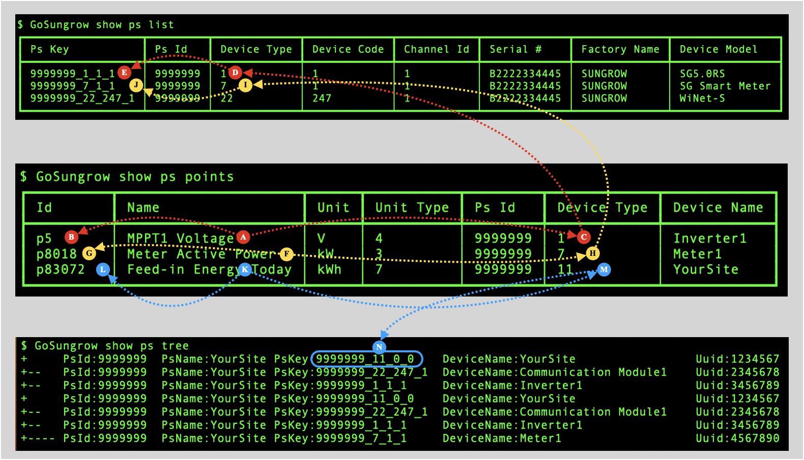
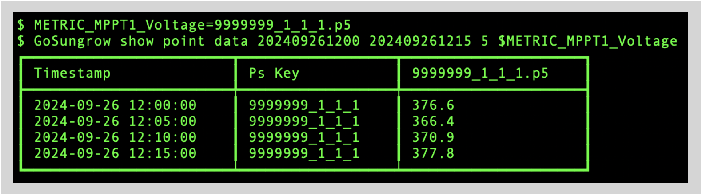
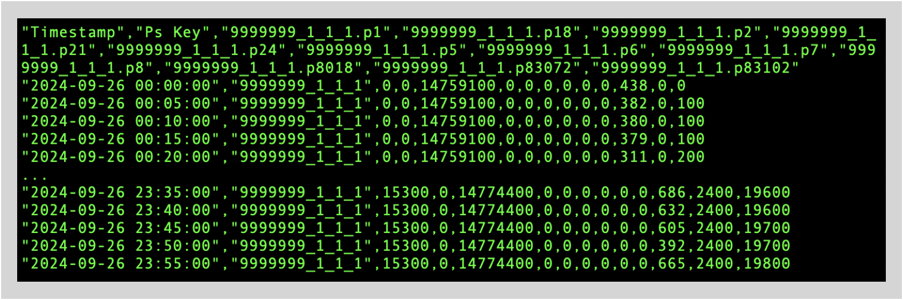

# Fetching data from Sungrow's iSolarCloud

I have been asked to share the script I use to fetch data for Sungrow inverters from iSolarCloud.

## Dependencies

The script is named `updateSungrowData`. It has two dependencies:

1. [GoSungrow](https://github.com/MickMake/GoSungrow) in its command-line form (ie not in a Docker container); and
2. `sungrowToCSV` which is a filter written in Swift.

### GoSungrow

See [Part 1 — Compiling GoSungrow](https://gist.github.com/Paraphraser/cad3b0aa6428c58ee87bc835ac12ed37#part1) for instructions on how to compile GoSungrow for your platform. If you do not want to go to the trouble of compiling GoSungrow yourself, see if [Part 3 — Using a patched binary](https://gist.github.com/Paraphraser/cad3b0aa6428c58ee87bc835ac12ed37#part3) of the same gist helps.

### sungrowToCSV

`sungrowToCSV` is a Unix filter (ie reads from `stdin`, writes to `stdout`) that I wrote in Swift. It is a "quick and dirty" single-purpose program that solves the problem of converting GoSungrow's textual reports to CSV (which I can then easily import into an SQLite database).

If you have Xcode installed, you can compile `sungrowToCSV` yourself. Alternatively, you can study the code to understand the algorithm and then construct your own equivalent in the programming language of your choice (eg Python).

In essence, the filter:

* reads lines from `stdin` until it reaches end-of-file;
* each line is separated into tokens using the "&#x2503;" character (Unicode 0x2503) which is the separator emitted by `GoSungrow` in its textual reports;
* any line containing at least two tokens is assumed to be either a header line or a data line. This implicitly excludes other table-formatting lines in `GoSungrow` reports;
* the tokens in each header and data line are iterated. If a token evaluates as a number, it is written to `stdout` "as is", otherwise it is wrapped in double quote marks;
* adjacent tokens are separated with commas, and lines are terminated with newline ("&#x240A;") characters. 

The `SQLiteTypeAffinity` enum is an affordance I use in many Swift programs. Although SQLite is not being used in this program, the enum is a handy way to determine whether a token needs to be quoted. You will need to come up with your own approach if you roll your own filter.

## updateSungrowData

### your Sungrow PsID

In theory, you should only need to set the value of `SUNGROW_PSID` to your own PsID and the script should have some chance of working:

```
SUNGROW_PSID=9999999
```

Unfortunately, I only have a single Sungrow inverter (SG5.0RS) and I don't have the ability to access anyone else's data. That means that I have no idea whether the identifiers for the metrics that I am retrieving via this script have *general* applicability or are *specific* to my own installation. This is something you will need to figure out for yourself.

### metric discovery

On the assumption that you will want to extend the example script to include other metrics, you will need to know how to discover metric identifiers. This is the basic approach you should follow.

Run the following commands:

``` console
$ GoSungrow show ps list
$ GoSungrow show ps points >ps-points.txt
$ GoSungrow show ps tree
```

For the `show ps points` command, I recommend redirecting standard output to a file. This is because the output is quite long (almost 1,000 lines in my single-inverter setup) and there is no point re-running the command when it is simpler to open the file in a text editor and browse to find the metrics you want.

[Figure 1](#figure1) is an example of the kind of patterns you should expect to see after you have run those commands.

| <a name="figure1"></a>Figure 1: Assembling Metric Identifiers  |
|:--------------------------------------------------------------:|
| |

I have selected three metrics as examples. Begin with the `show ps points` output (the middle table):

1. "MPPT1 Voltage" <!--A-->&#x1F130;

	* Make a note of the value in the "Id" column at which is "p5" <!--B-->&#x1F131;
	* Use the value of the "Device Type" column at <!--C-->&#x1F132; which is "1", and use it to find the same value in the "Device Type" column of the `show ps list` output at <!--D-->&#x1F133;
	* Make a note of the value in the "Ps Key" column at <!--E-->&#x1F134;, which is "9999999_1_1_1"
	* The metric identifier is the dot-concatenation of the "Ps Key" <!--E-->&#x1F134; with the "Id" at <!--B-->&#x1F131;:

		```
		METRIC_MPPT1_Voltage=9999999_1_1_1.p5
		```

2. "Meter Active Power" <!--F-->&#x1F135;

	Repeat the same process as for "MPPT1 Voltage" following the paths from <!--F-->&#x1F135; to <!--J-->&#x1F139;. You should wind up with a metric identifier of:

	```
	METRIC_Meter_Active_Power=9999999_7_1_1.p8018
	```

	While you are here, observe that the values in the "Ps Key" column are the result of concatenating the values in the "Ps Id", "Device Type", "Device Code" and "Channel Id" columns using underscores as separators.

	Also observe the **position** of the "Device Type" value in each "Ps Key" string. This will become important in a moment.

3. "Feed-in Energy Today" <!--K-->&#x1F13A;

	* Make a note of the value in the "Id" column at which is "p83072" <!--L-->&#x1F13B;
	* The value of the "Device Type" is "11" <!--M-->&#x1F13C; but that value does not appear in the `show ps list` output. When that happens, go to the `show ps tree` output and look for the value of the "Device Type" associated with one of the "PsKey" fields. In this case, it is at <!--N-->&#x1F13D;
	* Assemble the metric identifier:

		```
		METRIC_Daily_FeedIn_Energy=9999999_11_0_0.p83072
		```

	I have no idea why some Device Types are omitted from `show ps list`. In my case, Device Type 11 appears to be associated with the "Plant" concept and the value in the "Device Name" column is the name I gave the plant under guidance from the installer.

### testing metrics

You can test whether a metric is returning the data you expect by setting a smallish timespan that is likely to contain sensible data at the time of measurement (ie "when the sun is shining"). In [Figure 2](#figure2) "today" is Friday Sep 27, 2024 so "yesterday" is "20240926" and the timespan is 1200 through 1215 at five-minute intervals for `METRIC_MPPT1_Voltage`:

| <a name="figure2"></a>Figure 2: Testing Metric Identifiers |
|:----------------------------------------------------------:|
|  |

### variable simplification

You can keep iterating through the process of discovering and testing metric identifiers, modifying the script as you go. When you study your final list, you will realise that your "Ps ID" is common to all metrics, while various underscore-suffixes are common to groups of metrics. In other words, you can simplify your metric identifiers in two stages:

1. Abstract the common underscore-suffixes. For example:

	```
	SUNGROW_SG50RS=9999999_1_1_1
	METRIC_MPPT1_Voltage=${SUNGROW_SG50RS}.p5
	```

2. Abstract the common "Ps ID":

	```
	SUNGROW_PSID=9999999
	SUNGROW_SG50RS=${SUNGROW_PSID}_1_1_1
	METRIC_MPPT1_Voltage=${SUNGROW_SG50RS}.p5
	```

This makes it easier to add new metrics if you change your mind down the track.

### script operation

The script expects to be able to download to the path:

```
PORTAL="$HOME/Portal/$SUNGROW_PSID"
```

As you examine the script, you will see that as well as building up a collection of metrics to be retrieved, the script is designed to be run both "attended" from the command line and "unattended" via `cron`. In the latter form, the script writes logs to:

```
$PORTAL/updateSungrowData.log
```

This log is never pruned so you will need to do that yourself from time to time.

The script supports an optional numeric argument which is the number of days prior to "today" for which the script is to download data. If this argument is omitted, the value defaults to 1 (which has the semantic meaning of "yesterday" with respect to the moment when the script is running). This parameter is primarily of use when a communications problem prevents an automatic download and you need to repair the situation by hand. This is further discussed below under [crontab](#crontab).

Within the `$PORTAL` top-level folder, the script will create a sub-folder structure consisting of years and months, with the individual CSV data files for any given month collected together.

The presence of a daily download file is taken to mean that the script has already downloaded data for that day. Keep in mind that the mere *presence* of a file does not guarantee that its content is both valid and complete. Communications problems can easily result in partial or corrupt data.

> I load the CSV files into SQLite. I know a full day's data is going to contain 288 rows (24 hours * 60 minutes / 5 minutes sample period = 288) so any time I don't see 288 is an indication that I should go looking for an explanation. Thus far I have never encountered a situation where a report contains 288 rows but is otherwise invalid.

<a name="crontab"></a>
## crontab

This is the `crontab` entry that drives the show:

```
# run sungrow fetch
5 3-5 * * * ./.local/bin/updateSungrowData
```

The very useful [crontab guru](https://crontab.guru) confirms the meaning of that as:

> “At minute 5 past every hour from 3 through 5.”

In other words, the script is run at 03:05, 04:05 and 05:05 every day of the week. The three repetitions work in conjunction with the test in the script which determines whether "yesterday's" data has already been downloaded.

You should choose the times of day and numbers of repeats that work best for your situation.

On most days the 03:05 download succeeds and the two follow-up attempts are ignored. This scheme rides over *most* network or infrastructure problems which cause complete communications outages but it can't guard against a download that produces partial or erroneous data.

Recovering from a failed download is straightforward:

1. Delete the erroneous file.
2. Run `updateSungrowData` and pass it an argument of the number of days prior to today for which it should fetch data.

For example, suppose today is Friday and you discover that the downloads for both Wednesday and Thursday did not complete. You first delete the partial files dated for Wednesday and Thursday and then run:

``` console
$ updateSungrowData 2
$ updateSungrowData 1
```

## sample output

[Figure 3](#figure3) is from my own system. The fields in the header row might seem like they're a bit on the "uninformative" side but in practice they're fairly easy to deal with.

| <a name="figure3"></a>Figure 3: Sample Output (CSV)  |
|:----------------------------------------------------:|
|         |

The command-line tool I use to load the CSV into SQLite solves this kind of problem with lookup-tables. If you don't have such a tool, you can pipe the CSV to a `sed` script which replaces each header field with something human-readable. The scripts folder includes an example (`fix-headers`).
